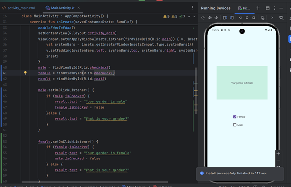

# Лабораторна робота №4
## Програмування для мобільних пристроїв
### Харківський національний економічний університет ім. С.Кузнеця

**Виконала**: Бабачанах К.С., студентка 4 курсу групи 6.04.122.010.21.2, факультету ІТ

---

## Вступ

Цей репозиторій містить усі виконані роботи та проекти.

---

## Огляд розділів

### Section 9 – Introduction to Android App Development 

Спочатку була інформація про налаштування та запуск емулятора.

Також, було інше відео, де розповідали про Genymotion - інший емулятор, який можна використовувати. Поки мені вистачає вбудованого емулятора в Android studio.   

Далі, була інформація про файл gradle 

- **XML Manifest файл**
  

- **User Permissions**
  

- **Далі, я ознайомилась з папкою з ресурсами **
  

- **У кінці секції 9 я пройшла тест  **
  

---

### Section 10 – Android Components 

У цій секції я ознайомилась з усіма компонентами, такими як Layouts, Constraint Layout, TextViews, Buttons, Edittexts, ImageView, CheckBox, Radio Buttons, Toggle, Spinner, Creating and adding menu items to toolbar. 

- **Створення макету**
  

- **Constraint Layout in Android 11**
  

- **Налаштування textviews1**
  

- **додавання нової дії для кілку по тексту та запуск застосунку**
  

- **Buttons**
  

- **Edittexts Android app**
  

- **ImageView in Android**
  

- **CheckBox in Android**
  

- **Radio Buttons in Android App Development**
  

- **Quiz 10**
  

---

### Section 11 – User Interactions in Android App Development

У цій секції я навчилась створювати Toast, Snackbar and Dialog Messages.

- **Toast Messages in Android App Development**

- **Snackbar Messages in Android App Development**
  

- **Dialog Messages**
  

- **Quiz 11**
  

---

### Section 12 – Lists & Views in Android App Development

У цій секції я навчилась створювати ListView, Recycler View, GridView, ScrollView and WebView.

- **Recycler View**

- **GridView**
  

- **ScrollView**
  

- **WebView**
  

- **Quiz 12**
  

---

### Section 13 – Intent and Lifestyles in Android App Development

У цій секції був матеріал про Intent, Application Lifecycle, Activity Lifecycle, Fragment Lifecycle, Services, Receivers, Android View Binding

- **Intent - Вводжу дані**

- **Intent - Після кліку на кнопку отримаю сторінку**
  

- **Application Lifecycle in Android App Development**
  

- **Fragment Lifecycle in Android App Development**
  

- **Services**
  

- **Quiz 13**
  

---

### Section 14 – Shared Preferences and Data Saving in Android App Development

У цій секції був матеріал про SharedPreferences Class, Saving Data Local Memory, Calling Back Data in Android App Development

- **Saving Data Local Memory**

- **Quiz 14**
  

---

### Section 15 – Device Compatibility in Android 12 App Development

У цій секції був матеріал про Multiple Language Support, Supporting Different Pixel Densities, Support Different Screen Sizes in Android App Development

- **Додавання української мови**

- **Мова застосунку якщо система на англ**
  

- **Мова застосунку якщо система на укр**
  

- **Quiz 15**
  

---

### Section 16 – Project 1 in Android App Development

У цій секції потрібно було створити To Do List

- **To Do List**

- **delete item**
  

- **logo project**
  

- **Quiz 16**
  

---

## Заключення

Цей курс забезпечив глибоке знайомство з розробкою мобільних додатків на платформі Android, зосереджуючись на практичному застосуванні теоретичних знань.

---

### Усі секції пройдені

